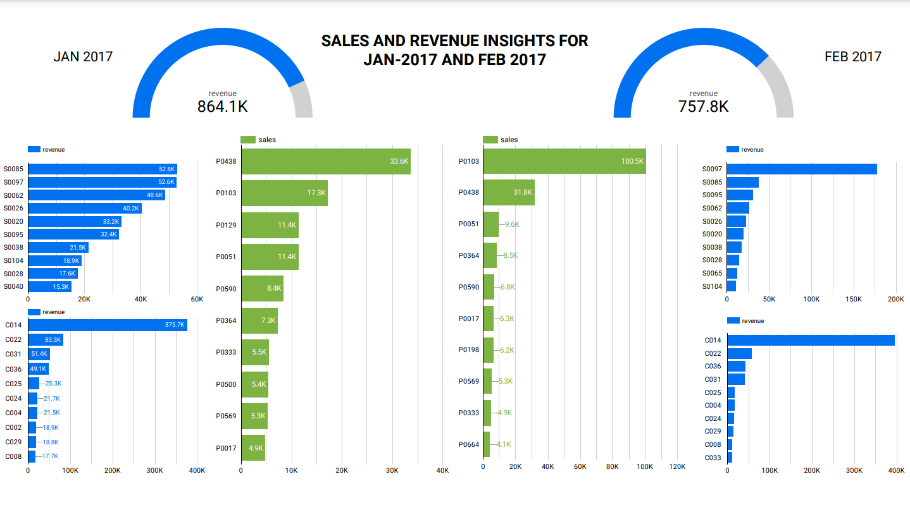

# Big_Data_Batch_Processing_Pipeline

A Data pipeline made using Apache Spark, Apache Airflow Deployed on GCP using Terraform.

## Description

### Objective
This project aims to simulate batch data processing activities for a retail chain where raw data produced by all the stores received in csv format goes through the cloud data pipeline to finally provide business insights on a Looker Studio Dashboard.

### Dataset

The dataset is sourced from Kaggle https://www.kaggle.com/datasets/berkayalan/retail-sales-data,
Contains data from a Turkish retail chain for years 2017 to 2019 consisting of 200 million records.

### Architecture

### Tools & Technologies

- Cloud - [**Google Cloud Platform**](https://cloud.google.com)
- Infrastructure as Code software - [**Terraform**](https://www.terraform.io)
- Orchestration - [**Airflow**](https://airflow.apache.org)
- Transformation and Batch Processing - [**Spark**](https://spark.apache.org/)
- Data Lake - [**Google Cloud Storage**](https://cloud.google.com/storage)
- Data Warehouse and Relational DB simulation - [**BigQuery**](https://cloud.google.com/bigquery)
- Data Visualization - [**Google Looker Studio**](https://datastudio.google.com/overview)
- Language - [**Python**](https://www.python.org)

### Final Result

This Dashboard shows top 10 revenue earning stores by their store id , Top 10 revenue earning cities and top 10 most sold products for the month of January and February of 2017

### Project Walkthrough

The cloud infrastructure for this project consists of :
1. 2 Linux VM instances, one each for running Spark and Airflow
2. 1 Google cloud storage bucket which will act as a data lake here
3. 2 Google big query Schemas,  
    a.Staging which will act as a data warehouse    
    b.Production which will act as a relational DB storing processed data  

